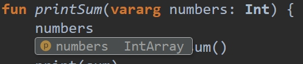

# 函数基础

## 函数声明和使用

我们在学习新的编程语言时，第一个程序往往是“Hello，World！”。在Kotlin中，只要一个函数就可以实现这个程序：

```kotlin
// SomeFile.kt
fun main(args: Array<String>) { // 声明了一个参数args，Kotlin_1.3.72版本之后将不再需要该参数
    println("Hello, World!") // 该函数等同于Java中的System.out.println
}
```

我们已经简单看到了一个函数是什么样子的，并且我们不用任何类就可以声明和使用它。一个函数由`fun`关键字、声明在括号里的参数和函数体组成，我们再来看一个有返回值的函数：

```kotlin
fun sum(a:Int,b:Int):Int{ // 与Java不同,返回值的类型定义在函数名称和参数表之后
    return a + b
}
```


在Java中，我们把类似的结构称作**方法**（Method），现在我们称作**函数**（Function）。它们之间的区别是这样的：

* 函数是指依照函数名调用的一段代码。而方法是和类（对象）的实例所关联的一个函数，有时又叫它成员函数。
* 简而言之，类内部的函数被称为方法。 一般说来，在Java中只有方法，但是学者有时会说静态Java方法实际上是函数。 在Kotlin中，我们定义函数可以不与任何对象相关联。


Kotlin调用函数的语法和Java等大部分编程语言类似：

```kotlin
val total = sum (12,24)//调用sum函数赋值给total变量
```

## 参数

在函数的声明中，每个参数都必须明确指定其类型。所有参数都被定义为不可变类型（只读）且无法被定义为可变的，因为可变类型的参数容易出错且在Java中经常被程序员误用。如果我们确实需要一个可变类型变量，那么可以在函数体中声明一个具有相同名称局部变量来作为影子变量：

```kotlin
fun findDuplicates(list: List<Int>): List<Int> {
    var list = list.sorted()
    //...
}
```

我们可以这么做，但会显示警号，因为这样的重复命名让我们难以定位问题并降低了代码的可读性。一个更好的办法是用数据的内容来命名参数，用数据的目的来命名变量，这两者在大多数情况下是不同的：

```kotlin
fun findDuplicates(originList<Int>): List<Int> {
    var sortedList = originList.sorted()
    //...
}
```


我们一直在使用参数这个术语，实际上它是有两种类型的：**形参**（Parameters）和**实参**（Arguments）。以我们上节末尾使用的`sum`函数来说：

* 形参指的是在函数声明中定义的变量，指的是`sum`函数声明时声明的`a`和`b`。
* 实参指的是在调用函数时传进去的实际值，指的是在调用`sum`函数时传入的`12`和`24`.


和Java中一样，实参是可以传入形参的子类型的。如果我们声明形参类型为`Any?`，那么我们可以传入任何值：

```kotlin
fun show(arg: Any?) {
    println("Hello. It is: $arg")
}
show(null)
// 打印结果: Hello. It is: null
show(1)
// 打印结果: Hello. It is: 1
show("Skr")
// 打印结果: Hello. It is: Skr函数
```

## 函数的返回类型

在Kotlin中，所有函数都是有返回值的，如果没有指定函数的返回类型，它的返回值默认为`Unit`类型。为了演示起见，我们可以显式声明出来：

```kotlin
fun printSum(a: Int, b: Int): Unit {//在实际编码中，可以省略Unit声明
    val sum = a + b
    print(sum)
}
```

`Unit`对象等价于Java中的`void`，可以被视作为一个普通的对象，可以赋值给其他变量：

```kotlin
val v = printSum(12, 24)
println(v is Unit) // 打印结果: true
```

`Unit`是一个单例，所以下列三个命题均为真：

```kotlin
println(p is Unit) //打印结果: true
println(p == Unit) // 打印结果: true
println(p === Unit) // 打印结果: true
```

使用不带任何值的`return`语句即可返回`Unit`类型：

```kotlin
fun printSum(a: Int, b: Int) { // 没有显式指定返回类型的情况下就会隐式设为Unit类型
    if(a < 0 || b < 0) {
        return // 函数的返回语句
    }
    val sum = a + b
    print(sum)
    // 函数执行完毕会自然返回，我们不必再使用函数返回语句
}
```

如果我们指定了`Unit`之外的返回类型，那么需要显式地使用返回语句，否则将视为错误：

```kotlin
fun sumPositive(a: Int, b: Int): Int {
    if(a > 0 && b > 0) {
        return a + b
    }
    // 错误，if条件不满足时函数没有显式的返回语句
}
```

简单地加上一个返回语句即可修复此问题：

```kotlin
fun sumPositive(a: Int, b: Int): Int {
    if(a > 0 && b > 0) {
        return a + b
    }
    return -1
}
```

## 可变参数

有些时候，我们在生命函数时并不知道要处理的参数的具体数目，在这种情况下，我们可以使用`vararg`修饰符修饰一个参数，这样这个参数就可以接受任意数量的参数：

```kotlin
fun printSum(vararg numbers: Int) {
    val sum = numbers.sum()
    print(sum)
}
printSum(1,2,3,4) // 打印结果: 10
printSum(1) // 打印结果: 1
printSum() // 打印结果: 0
```

实参中所包含的数据可以在函数体内部视为一个数组，数组的类型对应着参数的数据类型，一般来说，数组的数据类型会是泛型类`Array<T>，`但在上例中我们使用的是`Int`类型的参数，Kotlin有一个优化过的数组类型`IntArray`，Kotlin会自动使用这个更佳的选择：



我们仍然可以在可变参数之前声明普通的参数：

```kotlin
fun printAll(prefix: String, postfix: String, vararg texts: String){
    val allTexts = texts.joinToString(", ")
    println("$prefix$allTexts$postfix")
}
printAll("All texts: ","!" , "Hello", "World")
// 打印结果: All texts: Hello, World!
```

当我们使用可变参数时，可以一个一个地传参，也可以使用**延展操作符**（spread operator）一次性传进去整个数组：

```kotlin
printSum(1,2,3,4) // printSum函数定义参见本节开头，打印结果：10
val numbers = intArrayOf(1, 2, 3)
printSum(*numbers) // 打印结果：6
printSum(1,*numbers,2) // 打印结果：9
```

需要注意的是，一个函数只可以有一个可变参数。

## 单表达式函数

我们在实际的开发中，许多函数仅仅只有一个表达式，比如我们要获取某个控件上的文本：

```kotlin
fun getEmail(): String {
    return emailView.text.toString()
}
```

这种类型的代码在Android项目中随处可见，下面是一些常见的使用场景：

* 提取一些小的操作
* 使用多态来为一个类提供特定的值
* 在不同的架构层之间传递数据（上面的例子就可能出现在MVP设计模式中，用于View层与Presenter层传递数据）
* 基于递归的函数式编程风格函数

Kotlin中提供了一个改进的表示方法，当一个函数只包含一个表达式时，我们可以省略函数体，直接使用等号来指定表达式，这样定义的函数称为单表达式函数。

我们来用新的方式声明前面的函数：

```kotlin
fun getEmail() = emailView.text.toString()
```

这时候返回类型也成为了一个可选项，因为编译器可以从表达式中推断出来。

在Android的视图操作中，我们经常会与视图的Id打交道，来看看它怎么发挥作用：

```kotlin
class AddressAdapter : ItemAdapter<AddressAdapter.ViewHolder>() {
    override fun getLayoutId() = R.layout.choose_address_view
    override fun onCreateViewHolder(itemView: View) = ViewHolder(itemView)
    // ...
}
```

有时我们需要根据交互的视图来执行相应的操作：

```kotlin
override fun onOptionsItemSelected(item: MenuItem): Boolean = when{
    item.itemId == android.R.id.home -> {
        onBackPressed()
        true
    }
    else -> super.onOptionsItemSelected(item)
}
```

在链式操作一些数据时：

```kotlin
fun textFormatted(text: String, name: String) = text
                  .trim()
                  .capitalize()
                  .replace("{name}", name)
```

可以看到这个特性能让我们的代码更加简洁，更具可读性。单表达式函数在Android开发和函数式编程中的应用十分广泛。


**命令式编程**（Imperative programming）与**声明式编程**（Declarative programming）

* 命令式编程：这种编程范式描述的是执行一个操作所需的确切的步骤，非常直观。
* 声明式编程：这种编程范式描述的是预期的结果而不是实现的步骤，这意味着这种编程风格大多使用表达式或者声明，而非语句来完成。**函数式编程**（Functional programming）和**逻辑编程**（Logic programming）都被视作声明式编程风格，声明式编程通常比命令式编程更短，更具可读性。


## 尾递归函数（Tail-recursive function）

**递归函数**（Recursive function）是指调用自身的函数，比如：

```kotlin
fun getState(state: State, n: Int): State =
    if (n <= 0) state 
    else getState(nextState(state), n - 1)
```

递归函数是函数式编程的重要组成部分，问题是每个递归函数的调用需要将前一个函数的返回地址保存在栈上，如果递归进行地太深（栈上的函数太多）时会抛出`StackOverflowError`。

经典的解决办法是使用遍历来代替递归：

```kotlin
fun getState(state: State, n: Int): State {
    var state = state
    for (i in 1..n) {
        state = state.nextState()
    }
    return state
}
```

但是由于遍历和递归在思路上有着本质的区别，所以更适当的解决方式是使用像Kotlin这样的现代编程语言提供的尾递归函数。尾递归函数是一种特殊的递归函数，该函数将调用自身作为执行的最后一个操作（换句话说，递归发生在函数的最后一个操作中）。这使我们可以优化编译器进行的递归调用，并以更加有效的方式执行递归操作，而且无需担心潜在的`StackOverflowError`。要使函数尾递归，我们需要用tailrec修饰符标记它：

```kotlin
tailrec fun getState(state: State, n: Int): State =
    if (n <= 0) state
    else getState(state.nextState(), n - 1)
```

为了弄清楚它的工作原理，我们将它编译后再反编译为Java代码，我们可以看到这些（代码经过简化）：

```kotlin
public static final State getState(@NotNull State state, int n){
    while(true) {
        if(n <= 0) {
            return state;
        }
        state = state.nextState();
        n = n - 1;
    }
}
```

可以看到底层实现方式仍是遍历，这就是为什么不会出现`StackOverflowError`。但在编写代码时我们可以用递归的思想去编写，使用递归的代码往往会更加简洁。

使用尾递归函数要满足三个条件：

* 函数只能在执行最后一个操作时调用自身
* 不能在`try` / `catch` / `finally`代码块中使用
* 在撰写本文时，仅允许Kotlin编译为JVM平台代码时使用


