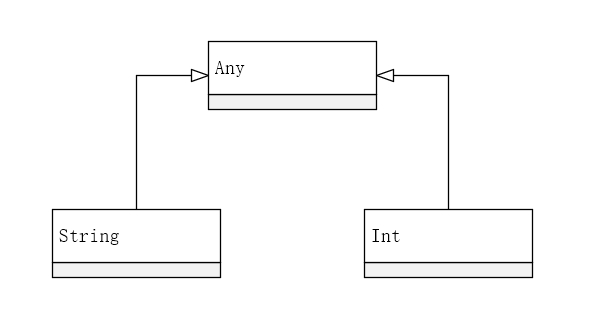
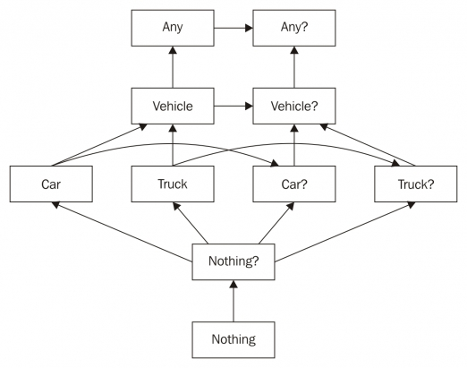
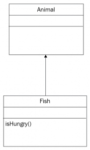
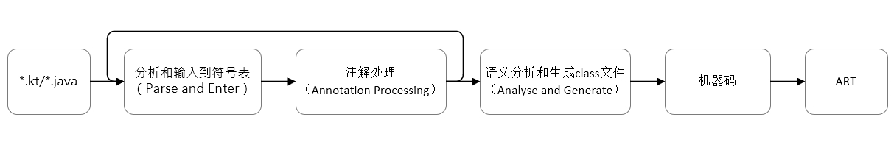

# Kotlin基础

## 变量（Variable）

在Kotlin中有两种变量：`var`和 `val`。`var`是可变的，即可以在初始化赋值之后可以被重新赋值，等同于Java中的普通变量。

```kotlin
fun main() {
    var fruit: String = "orange" //创建变量fruit并初始化赋值orange
    fruit = "banana" //将fruit变量重新赋值为banana
}
```

`val`是不可变的，即在初始化赋值之后不能被重新赋值，相当于Java中带`final`修饰符的变量。但它不能保证引用的对象中的值不会被修改（重新赋值）：

```kotlin
class Fruit(var name:String)//类的声明会在第四章中说明
fun main() {
    val fruit = Fruit("orange")//创建变量fruit并初始化
    fruit = Fruit("banana")//错误，不能进行重新赋值
    fruit.name = "banana"//正确，引用中对象的值可以被修改
}
```

由于`val`变量可以有一个自定义getter，所以我们也不能保证每一次的访问就是返回的都是同一个对象：

```kotlin
val random: Int
get() = Random().nextInt()//自定义getter将会在第四章中说明
```


Kotlin是允许在文件级别定义变量和函数的，而Java必须要在类中定义。


## 类型推断（Type inference）

和Java中不同，Kotlin的变量类型声明在变量名之后：

```kotlin
var fruit: String
```

虽然第一眼看起来有些奇怪，但是这个结构是Kotlin类型推断的重要组成部分。类型推断就是编译器可以根据上下文来推断变量的数据类型，比如当变量声明和初始化写在一起时，我们可以省略类型声明。

```kotlin
var fruit: String = "orange"//完整声明
var fruit = "orange"//省略类型声明
```

上面虽然类型声明被省略了，但数据类型会被隐式地设置为`String`，因为Kotlin是强类型的语言。在随后的使用中编译器会验证是否符合正确的数据类型：

```kotlin
var fruit = "orange"
fruit = 10 //错误，fruit被推断为String类型，无法赋值int类型数据
```

我们可以通过显式声明两者都适用的数据类型使上面的赋值成立：

```kotlin
var fruit: Any = "orange"
fruit = 10
```

`Any`相当于`Java`中的Object，处于继承层级的顶端。

编译器同样可以从函数进行类型推断：

```kotlin
val total = sum(16, 64)
```

有时候我们自己并不确定编译器到底给这个变量设置了什么数据类型，这个类型可能是`Int`，也可能是`Double`或者`Float`，我们可以将插入符置于变量名上，按快捷键（Windows中的是**Shift + Ctrl + P**，macOS中的是**arrow key + control + P**）显示具体推断成何种数据类型：


类型推断同样适用于泛型：

```kotlin
var persons = listOf(personInstance1, personInstance2)
```

假设我们传入的是`Person`类，那么上面的推断类型就为`List<Person>`。

再比如`Pair`泛型类的推断：

```kotlin
var pair = "Everest" to 8848 // 推断类型为 Pair<String, Int>
```

类型推断还能在更复杂的场景中工作，比如根据一个被推断好的类型来进行推断：

```kotlin
var map = mapOf("Everest" to 8848, "Mont Blanc" to 4810)
// 推断类型为 Map<String, Int>
var map = mapOf("Everest" to 8848, "Mont Blanc" to "4810")
// 推断类型为 Map<String, Any>
```

`Map`的类型由`Pair`的类型推断而来，`Pair`的类型由传进去参数的类型推断而来。当传入不同类型的参数时，编译器会寻找最近的共有类型。在上面的例子中编译器选择了`Any`，因为`String`和`Int`都继承自`Any`：



我们可以看到，类型推断可以很好地帮我们精简一部分代码，减少一些工作。但我们有时还是需要手动明确声明数据类型：

```kotlin
var time = 18 //使用整数时，默认的推断类型是Int
var time: Long = 18 //显示声明数据类型为Long
var time = 18L //用字面常量（literal constant）声明数据类型为Long
```


[关于字面常量是什么及译法](http://blog.sina.com.cn/s/blog_5d29ee450102w85l.html)


因为Kotlin是强类型语言，当编译器缺少信息确定变量的数据类型时，我们就需要显式声明它，否则将被视为错误：

```kotlin
var name //错误，编译器无法得知它会存储什么类型的值
```

## 严格空类型安全（Strict null safety）

在使用Java开发时，最常见的错误就是空指针异常（NullPointerExceptions）。Sir Tony Hoare在2009年3月的Qcon技术会议上发表了题为“Null引用：代价十亿美元的错误”的演讲，回忆自己1965年设计第一个全面的类型系统时，未能抵御住诱惑，加入了Null引用，仅仅是因为实现起来非常容易。它后来成为许多程序设计语言的标准特性，导致了数不清的错误、漏洞和系统崩溃，可能在之后40年中造成了十亿美元的损失。

为了避免空指针异常，我们需要编写防御性的代码，在使用一个对象前检查它是否为空。包括Kotlin在内的许多现代编程语言采取了行动，将这种运行时的错误转化为编译时错误以提升编程语言的安全性。Kotlin实现这个目的的途径就是为语言类型增加**可空性安全机制**（nullability safeness mechanisms），Kotlin的类型系统会区分**可空类型**（nullable type）和**非空类型**（non-nullable type），这样可以在开发期间检测和预防非常多的空指针异常。

严格空类型安全是Kotlin类型系统的一部分。默认类型是非空的，如果想存储可能为空的数据必须要显式声明它是可空类型的：

```kotlin
val age: Int = null //错误，默认类型不可为空
val name: String? = null //正确，加?后缀标记是一个可空变量
```

可空类型的引用不能直接调用方法，除非在调用前进行了非空检查：

```kotlin
val name: String? = null
// ...
name.toUpperCase() // 错误，引用可能为空
```

每一个非空类型都有一个对应的可空类型：`Int`对应`Int?`、`String`对应`String?`等。这个规则也适用于所有Android Framework中的类（`View`对应`View?`）、第三方库中的类（`OkHttpClient`对应`OkHttpClient?`）、自定义的类（`MyCustomClass`对应`MyCustomClass?`），也就是说每个非泛型类都定义两种类型：可空类型和非空类型，非空类型是它对应的可空类型的子类：



`Nothing`是一个虚类型（uninhabited type），无法拥有实例。这样的继承结构也说明了为什么非空类型可以复制给它对应的可空类型，反之则不行：

```kotlin
var nullableView: View?
var view: View
nullableView = view // 正确，虽然view和nullableView类型不一致，但是其子类
view = nullableView // 错误，nullableView和view类型不一致，也不是其子类
```

泛型类则有更多的可能，以`ArrayList`为例：

| 类型声明 | ArrayList自身是否可空 | ArrayList中的元素是否可空 |
| :--- | :--- | :--- |
| ArrayList&lt;Int&gt; | 否 | 否 |
| ArrayList&lt;Int&gt;? | 是 | 否 |
| ArrayList&lt;Int?&gt; | 否 | 是 |
| ArrayList&lt;Int?&gt;? | 是 | 是 |

让我们来看一个使用Java开发Android时常见的错误：

```kotlin
//Java
@Override
public void onCreate(Bundle savedInstanceState) {
    super.onCreate(savedInstanceState);
    savedInstanceState.getBoolean("theKey");
}
```

这段代码会通过编译，但会在运行时崩溃并抛出空指针异常。我们知道，`Activity`在第一次创建时该方法会被传进去一个空值，只有在用一个保存的状态重新创建`Activity`时该值才会不为空。

我们看一下上面的代码用Kotlin写会怎样：

```kotlin
//Kotlin
override fun onCreate(savedInstanceState: Bundle?) {
    super.onCreate(savedInstanceState)
    savedInstanceState.getBoolean("theKey") // 错误
}
```

这段代码将无法通过编译，因为Kotlin不允许不检查可空引用就调用它的方法。

我们加上空值检查就可以解决这个问题：

```kotlin
override fun onCreate(savedInstanceState: Bundle?) {
    super.onCreate(savedInstanceState)
    
    val locked: Boolean
    if(savedInstanceState != null)
        locked = savedInstanceState.getBoolean("theKey")
    else
        locked = false
}
```

虽然这种处理方式在Java中司空见惯，但这样写代码无法让人一眼就能看出它的含义。现在Kotlin允许用更简洁的方式处理这类问题，比如**安全调用操作符**（safe call operator）。

## **安全调用操作符**（Safe call operator）

安全调用操作符由一个问号和点表示（`?.`）。如果操作符左侧为空则返回空值，否则返回右侧的表达式的执行结果：

```kotlin
override fun onCreate(savedInstanceState: Bundle?) {
    super.onCreate(savedInstanceState)
    val locked: Boolean? = savedInstanceState?.getBoolean("theKey")
}
```

如果`savedInstanceState`为空，返回空值，反之则返回`savedInstanceState?.getBoolean("theKey")`的执行结果。

在Java代码中常常见到的嵌套空值检查，也可以用Kotlin中的安全调用操作符写得更简明：

```kotlin
//Java
Boolean isCorrect;
if(quiz != null ){
    if(quiz.currentQuestion != null) {
        if(quiz.currentQuestion.answer != null ) {
            isCorrect = quiz.currentQuestion.answer.isCorrect();
        }
    }
}
//Kotlin
val isCorrect= quiz?.currentQuestion?.answer?.isCorrect
```

在上面的调用链中，当任何一个安全调用操作符左侧为空就会返回空值。有时我们想在取得的对象为空时也能有一个默认值，除了经典的`if`-`else`解决方案，我们还可以用更简洁的**猫王操作符**（Elvis operator）。

## **猫王操作符**（Elvis operator）

猫王操作符由一个问号和冒号表示（`?:`）。它的语法是：`first operand ?: second operand`。它的执行逻辑是当第一个操作数不为空时返回**第一个操作数**（first operand），否则返回**第二个操作数**（second operand）。

有了它我们可以很方便地为上节例子加上默认值（false）：

```kotlin
override fun onCreate(savedInstanceState: Bundle?) {
    super.onCreate(savedInstanceState)
    val locked: Boolean = savedInstanceState?.getBoolean("theKey") ?: false
}
```

还可以用在上节第二个例子：

```kotlin
val isCorrect = quiz?.currentQuestion?.answer?.isCorrect ?: false
```

并且编译器会智能地将`isCorrect`推断为非空类型。


[关于猫王操作符名称的由来](http://dobsondev.com/2014/06/06/the-elvis-operator/)


## 非空断言操作符（Not-null assertion operator）

非空断言操作符由两个叹号组成（`!!`）。这个操作符可以显式地将可空类型转化为非空类型：

```kotlin
var testStr: String? = "test"
var size: Int = testStr!!.length
```

一般来说，Kotlin不允许我们直接访问可空类型变量`testStr`的属性`length`。当我们用非空断言操作符显式将其转换为非空类型就可以直接访问了。然而如果我们的判断错误，那么程序将会在运行时抛出空指针异常。

```kotlin
override fun onCreate(savedInstanceState: Bundle?) {
    super.onCreate(savedInstanceState)
    val locked: Boolean = savedInstanceState!!.getBoolean("theKey")
}
```

上面的代码会编译通过，但是我们知道，当一个新创建的`Activity`时，它的`savedInstanceState`将会是空，此时上面的代码会抛出空指针异常。

看到非空断言操作符时，它意味着潜在的空指针异常，此时代码的工作方式更像Java。所以我们必须小心地使用它，大部分情况应该被安全调用和智能类型转换来代替。


关于非空断言操作符的一些使用建议：[https://medium.com/@igorwojda/kotlin-combating-non-null-assertions-5282d7b97205](https://medium.com/@igorwojda/kotlin-combating-non-null-assertions-5282d7b97205)


## 平台类型（Platform type）

我们知道大部分Android SDK和库由Java写成，虽然编译器可以通过注解来获取Java中的可空性信息，但大部分Java变量没有注解，我们可以把它们都看作可空类型并每次访问时检查可空性，但这显然不是上策。

于是Kotlin引入了平台类型，平台类型不能由开发者自己定义，但我们可以在异常信息和方法参数列表中看到这种特殊的语法（类型名后加`!`）：

```kotlin
View! // View 定义成了一个平台类型
```

平台类型可以是为可空类型也可以视为非空类型，相当于一个待定类型。决定如何使用以及正确使用是我们开发者的责任。例如：

```kotlin
val textView = findViewById(R.id.textView)
```

在一般情况下，Kotlin编译器并不知道`findViewById`方法会返回可空类型还是非空类型，这也是`View`被设置为平台类型的原因。这时候我们开发者就必须确定它的可空性。如果我们在所有布局文件都有关于这个`textView`的定义（无论横屏、竖屏、大屏、小屏等的布局文件），那么我们可以将它设置为非空类型，否则（比如只有横屏布局中有定义）我们应该把它设置为可空类型。

```kotlin
val textView = findViewById(R.id.textView) as TextView // 设置为非空类型
val textView = findViewById(R.id.textView) as TextView? // 设置为可空类型
```

## 类型转换（Cast）

类型转换概念许多编程语言都支持。在Java中在访问某个类型的变量成员前我们需要显式地将其转换为该类型。Kotlin在类型转换方面也做了改进，引入了**安全类型转换**（safe cast）和**智能类型转换**（smart cast）。

### 安全类型转换和不安全类型转换

让我们先看Java中的类型转换：

```kotlin
Fragment fragment = new ProductFragment();
ProductFragment productFragment = (ProductFragment) fragment
```

在Kotlin中用`as`关键字来进行类型转换：

```kotlin
val fragment: Fragment = ProductFragment()
val productFragment: ProductFragment = fragment as ProductFragment
```

`ProductFragment`是`Fragment`的子类型，上面的代码能够正常工作。但如果仅仅是变量名相似而实际上转换前后的类型并无关系，那么就会引起`ClassCastException`：

```kotlin
val fragment : String = "ProductFragment"
val productFragment : ProductFragment = fragment as ProductFragment
// 抛出异常: ClassCastException
```

由于可能引发异常，因此通过`as`进行的类型转换是不安全的类型转换。为了解决这个问题，Kotlin引入了安全类型转换操作符（`as?`），它也叫**可空类型转换操作符**（nullable cast operator）。如果被转换的变量可以完成转换就会成功进行类型转换，如果不行则会返回空值：

```kotlin
val fragment: String = "ProductFragment"
val productFragment: ProductFragment? = fragment as? ProductFragment
// 得到null，不会抛出异常
```

在我们的程序运行逻辑中，`productFragment`常常是一个必不可少的变量，如果我们希望得到一个非空类型的`productFragment`，那么我们可以使用猫王操作符：

```kotlin
val fragment: String = "ProductFragment"
val productFragment: ProductFragment? = fragment as? ProductFragment ?: ProductFragment()
```

当我们转换Kotlin中的**基本类型**（primitive type）时，我们可以直接使用标准库中自带的方法：

```kotlin
val name: String
val age: Int = 12
name = age.toString()
```

### 智能类型转换

与显式使用`as`关键字进行转换不同，智能类型转换是隐式的。当编译器完全确定在类型检查后变量类型不会改变时，才会进行智能类型转换。一般来说，智能类型转换对不可变的引用（`val`）和本地可变引用（`var`）起效。

我们假设两个类有这样一个继承关系：



如果我们需要把一个`Animal`变量进行类型转换为`Tiger`然后调用其成员方法，在Java中我们需要这样做：

```kotlin
//Java
if (animal instanceof Tiger){
    Tiger tiger = (Tiger) animal;
    tiger.isHungry();
    //或者
    ((Tiger) animal).isHungry();
}
```

代码是有些冗余的，假设我们在检查`animal`是否是`Tiger`类型时编译器替我们完成转换不是更好吗？Kotlin中的智能类型转换可以实现这一点：

```kotlin
//Kotlin
if (animal is Tiger) {
    animal.isHungry()
}
```

但是在`if`的花括号之外，编译器并不知道`animal`会是什么类型，会被我们如何处理。所以上面的智能类型转换范围仅限于花括号之内：

```kotlin
if (animal is Tiger) {
    animal.isHungry()
}
animal.isHungry() //错误
```

如果我们想反过来用也是可以的：

```kotlin
if (animal !is Tiger) 
    return
animal.isHungry() //执行到这里编译器同样能确定animal是Tiger类的实例
```

在条件表达式使用中，由于`&&`和`||`具有短路效果。以`condition1() && condition2()`为例，当左侧`conditon1()`为返回true时，右侧`candition2()`才会执行。因此智能类型转换在此处也有效：

```kotlin
if (animal is Tiger&& animal.isHungry()) {
    println("Tiger is hungry")
}
```

之前我们说过可空类型必须要经过非空检查才能访问其成员，实际上经过检查后智能类型转换已经将可空类型已经转化为非空类型：

```kotlin
val view: View?
if ( view != null ){
    view.isShown() // view已被转换成非空类型，可以直接访问其成员方法
}
view.isShown() // 错误，view可能为空
```

总之，无论通过类型检查还是逻辑语句，让编译器完全确定是这个类型后，编译器就会为我们执行隐式的智能类型转换。

## 基础数据类型（Primitive data type）

Java中`int`是基础数据类型，而`Integer`为`int`的**装箱类型**（boxed representation）。装箱（`Boxing`）是将一个基础数据类型包装为一个引用类型使其具有和对象一样的性质。

在Kotlin中，一切都是对象。`Int`、`Long`、`Char`等在内也不例外。这样一来就简化了代码的复杂性。我们可以直接像使用一个普通对象一样对`Int`类型进行操作：

```kotlin
val code: Int = 25
code.toChar()
```

为了优化性能，Kotlin在编译为JVM字节码时仍然会尽可能的优化为Java对应的基础数据类型。但我们知道Kotlin中非空类型`Int`是有一个对应的可空类型`Int?`的，那么可空类型就会被转译为Java中对应的装箱类型。举个例子：Kotlin中的`Int`存储为Java中的`int`，Kotlin中的`Int?`存储为Java中的`Integer`。

```kotlin
var a: Int = 1 // 被存储为基础数据类型
var b: Int? = null // 被存储为装箱数据类型
b = 24 // 即使有值也被存储为装箱数据类型
```

我们可以看到Kotlin虽然将基础数据类型也视作对象来对待和使用，但Java中的装箱概念仍然在默默影响着Kotlin代码的实际性能。装箱类型会比基础数据类型消耗更多的资源，如果是仅仅数个变量，那我们无需担心它的影响，但在拥有海量数据的列表和数组中可能是影响其性能的关键。所以我们来看一下这些“基础数据类型”。

### 数字

Kotlin用于存储数字的数据类型等同于Java的基础数据类型：

| 数据类型 | 存储位宽\(Bit\) |
| :--- | :--- |
| Int | 32 |
| Short | 16 |
| Long | 64 |
| Float | 32 |
| Double | 64 |
| Byte | 8 |

与Java中不同的一点是，Kotlin中不会为数字类型提供隐式的转换，需要显式地通过标准库的方法转换：

```kotlin
//Java
int myWeight = 88;
long rocketWeight = myWeight;
//Kotlin
var myWeight : Int = 88
var rocketWeight: Long = myWeight // 错误，数据类型不一致
var rocketWeight: Long = myWeight.toLong()//正确
```

表面上看，它增加了代码的冗余度，但它同时也防止了可能因隐式转换导致数据丢失等意料之外的错误，变得更加安全。

### 字符

Kotlin中使用字符和Java基本一致，单引号声明`Char`类型，双引号声明`String`类型，特殊字符用反斜杠转义：

```kotlin
val char = 'a' // 声明一个Char类型
val string = "a" // 声明一个String类型
```

常见的特殊字符：

| 转义方式 | 含义 |
| :--- | :--- |
| \t | 制表符 |
| \b | 退格符 |
| \n | 换行符 |
| \r | 回车 |
| \' | 单引号 |
| \" | 双引号 |
| \\ | 反斜杠 |
| \$ | 美元符 |
| \u | Unicode转义序列 |

### 数组

在Kotlin中，一切皆对象。数组由`Array`类来表示，创建一个数组最简单的方法是用标准库中的`arrayOf`函数：

```kotlin
val array0 = arrayOf(1,2,3) // 推断类型为 Array<Int>
val array1: Array<Short> = arrayOf(1,2,3) //显式声明类型为Array<Short>
val array2: Array<Long> = arrayOf(1,2,3) //显式声明类型为Array<Long>
```

因为`Array`是泛型类，它创建时会使用装箱类型。我们知道装箱类型会影响性能，所以Kotlin也准备了基础数据类型的数组类来减少对性能的损耗，如：`IntArray`、`ShortArray`、`LongArray`等，他们之间和`Array`类并无继承关系。我们同样是通过标准库的函数去创建它们：

```kotlin
val array0 = intArrayOf(1, 2, 3) //创建IntArray
val array1 = shortArrayOf(1, 2, 3) //创建ShortArray
val array2 = longArrayOf(1, 2, 3) //创建LongArray
```

Kotlin中数组下标同样是从0开始，语法也和Java的一致：

```kotlin
val array = arrayOf(1,2,3)
println(array[1]) //打印结果: 2
```

### 布尔类型

在Kotlin中布尔类型同样被视为对象，使用方式和其它的基础数据类型相似：

```kotlin
val isCorrect: Boolean = true //对应Java中的基础数据类型
val isCorrect: Boolean? = null //对应Java中的装箱类型
```

与之配套的还有我们经常使用的逻辑操作符：

* `||`：逻辑或，两侧**命题**（Predicate）有一侧为真结果即为**真**（true），否则为**假**（false）。
* `&&`：逻辑与，两侧命题同时为真结果即为真，否则为假。
* `!`：逻辑非，命题为真结果即为假，命题为假结果即为真。

`||`和`&&`操作符具有短路的性质，英文称为lazy conjunction。`||`操作符在左侧命题为真时，会跳过右侧命题直接得出结果（真）。同样`&&`会在左侧命题为假时直接得出结果（假）。

## 复合数据类型（Composite data type）

相比于Java，Kotlin引入了一些新的复合数据类型，也对经典的复合数据类型做了改进。

### 字符串

Kotlin中字符串的使用方式和Java大致相同，也有一些新的特性。在Kotlin中字符串可以像数组那样使用下标访问对应的字符，即可以当作一个字符数组来使用：

```kotlin
val str = "abcd"
println (str[1]) // 打印结果: b
```

在Java中，通常字符串构建我们会简单地用`+`号来操作：

```kotlin
String name = "Mamun";
int age = 27;
String message = "My name is" + name + "and I am" + age + "years old";
```

这种方法很容易操作，但是可读性较差。在Java中我们也可以用类C语言的方式格式化字符串以获得我们想要的结果：

```kotlin
String name = "Mamun";
int age = 27;
String message = String.format("My name is %s and I am %d years old" ,name,age);
```

其中`%s`是字符串类型的占位符，`%d`是整型（十进制）的占位符。这样的实现方式提高了可读性，但我们必须记忆或查阅对应数据类型的占位符，否则就会出错，这提高了出错的可能性。而在Kotlin中我们使用字符串模板特性会使这项任务更加简单：

```kotlin
val name = "Mamun"
val age = 27
val message = "My name is $name and I am $age years old"
println(message)
//打印结果:Prints: My name is Mamun and I am 27 years old
```

我们看到字符串和数字都只用美元符`$`创建的占位符就可以了，甚至我们可以在里面放表达式：

```kotlin
val name = "Mamun"
val message = "My name has ${name.length} characters"
println(message) //打印结果: My name has 5 characters
```

### 范围（Range）

Range是定义一组连续的值的新方式，它由第一个值和最后一个值来表示这组序列。它的操作符由两个点（`..`）表示：

```kotlin
val intRange = 1..5
val charRange = 'a'..'e'
```

我们可以用`in`关键字和for each循环来遍历该数据类型：

```kotlin
for (i in intRange) print(i) // Prints: 12345
for (i in charRange) print(i) // Prints: abcde
```

某个特定的值可以用`in`关键字检查是否在范围之内：

```kotlin
val BMI0 = 20
val BMI1 = 24
val healthy = 18..23
if (BMI0  in healthy)
println("$BMI0 is in $healthy range") //Prints: 20 is in 18..23 range
if (BMI1 !in healthy)
println("$BMI1 is not in $healthy range") //Prints: 24 is not in 18..23 range
```

范围默认是升序的，如果想用降序的范围，我们可以使用`downTo`操作符：

```kotlin
for (i in 5 downTo 1) print(i) // 打印结果: 54321
```

默认步进为1，即范围元素间差值为1，我们可以使用`step`关键字设置步进，且步进必须为正数：

```kotlin
for (i in 1..9 step 2) print(i) // 打印结果: 13579
for (i in 9 downTo 1 step 3) print(i) // 打印结果: 963
```

### 集合（Collection）

Kotlin引入了许多新特性，集合类的新特性与这些新特性密切相关，我们将在稍后的章节（第七章）讨论它们。

## 语句和表达式

我们知道，程序由数据结构和算法构成。上面我们主要讲的是Kotlin的数据结构相关的知识，在接下来程序算法的基础知识开始之前，我们先了解下语句和表达式的区别：

**表达式**（expression）会产生一个值，可以用来用在给变量赋值，传参以及用在另一个表达式中。表达式由**操作数**（operand）和**操作符**（operator）组成:

```kotlin
var total = a + b
```

这个表达式用来给变量`total`赋值，`a`和`b`是操作数（被操作的数据），`+`是操作符（代表该操作的符号）。

**语句**（statement）指不会产生值的操作，类、接口、函数、变量的声明、控制流等都是语句，没有用到表达式的值的时候，表达式也可以看作语句：

```kotlin
 MyClass
```

Kotlin是一个面向表达式的语言，以前在Java中被视作语句的代码，在Kotlin中也能被视为表达式，比如**控制流**（Control flow），在Java中我们把它们看作语句，而在Kotlin中被视作表达式（循环除外）。

## 控制流（Control flow）

Kotlin引入了一种新的控制流结构`when`用来代替Java的`switch... case`。同时除了循环语句之外，其他控制流结构在Kotlin中被视为表达式。

### if

`if`的工作方式和Java很类似：

```kotlin
if(x > 10)
    println("greater")
else
    println("smaller")
```

正如我们前面提到的，Kotlin将`if`视为表达式，这样可以写出更简洁的语法：

```kotlin
println(if(x > 10) "greater" else "smaller")
```

表达式的值正是返回分支的最后一句。若`x`大于10，返回greater；若`x`小于10，返回smaller。当我们把`if`当作语句使用时，返回值就会被忽略掉。这种视为表达式的特性给我们提供了更多的可能。

### when

`when`在Kotlin中是多路选择表达式，一般来说它比是大段的`if...else if`语句是更好的选择。它的语法更加简洁：

```kotlin
when (x) {
    1 -> print("x == 1")
    2 -> print("x == 2")
    else -> println("x is neither 1 nor 2")
}
```

`when`语句会依次检查每个条件，直到某一个条件满足，它和Java的`switch... case`的工作方式很像，但它不需要每个条件都写冗余的`break`语句。

与`if`类似，`when`语句也会返回被满足条件分支的最后一句作为表达式的返回值。

```kotlin
val animal = "Tiger"
val message= when (vehicle) {
    "Tiger" -> {
        // Some code
        "Four legs"
    }
    "Monkey"->{
        // Some code
        "Two legs"
    }
    else -> {
        //some code
        "Unknown number of legs"
    }
}
println(message) //打印结果: Four legs
```

到这里，我们大概意识到返回最后一行在Kotlin中是一个常见的行为，我们在随后接触lambda表达式时也会看到。

当我们把`when`当作表达式使用时，`else`语句是不可缺少的，正如Java中的`default`语句。我们还可以把多个条件放在同一个分支，条件之间用逗号隔开：

```kotlin
val animal = "Tiger"
when (vehicle) {
    "Tiger", "Monkey" -> print("Animal")
    else -> print("Unidentified object")
}//打印结果：Animal
```

`when`还可以用`is`关键字很方便地检查变量的类型，同时这里也支持智能类型转换：

```kotlin
val name = when (person) {
    is String -> person.toUpperCase()//这里进行了智能类型转换
    is User -> person.name
}
```

检查是否在一个`Range`中同理：

```kotlin
val riskAssessment = 80
val risk = when (riskAssessment) {
    in 1..20 -> "negligible risk"
    in 21..40 -> "minor risk"
    in 41..60 -> "major risk"
    else -> "undefined risk"
}
println(risk) // 打印结果: undefined risk
```

同时`when`还支持嵌套使用：

```kotlin
val riskAssessment = 80
val handleStrategy = "Warn"
val risk = when (riskAssessment) {
    in 1..20 -> print("negligible risk")
    in 21..40 -> print("minor risk")
    in 41..60 -> print("major risk")
    else -> when (handleStrategy){
                "Warn" -> "Risk assessment warning"
                "Ignore" -> "Risk ignored"
                else -> "Unknown risk!"
            }
}
println(risk) // 打印结果: Risk assessment warning
```

由此可见，`when`是一个很强大的控制流结构，比`if...else if`语句更加简明，比`switch... case`有更强的控制能力。

### 循环（Loop）

循环是一种直到终止条件满足才会停止执行的控制结构。在Kotlin中循环语句可以遍历任何提供**迭代器**（iterator）的对象。迭代器是一个接口，里面有两个方法：`hasNext` 和`next`。我们也可以在我们自定义类中实现这个接口来方便我们的遍历操作。

Kotlin中提供了三种循环结构：`for`、`while`和 `do... while`，它们的工作方式和其他编程语言大致相同，我们简单介绍一下。

#### for

我们可以直接用`in`关键字遍历：

```kotlin
var array = arrayOf(1, 2, 3)
for (item in array)
    print(item)
```

也可以用序号遍历：

```kotlin
for (i in array.indices)
    print(array[i])
```

还可以用解构声明遍历：

```kotlin
for ((index, value) in array.withIndex()) {
    println("Element at $index is $value")
}
```

#### while

第一种结构：

```kotlin
while (condition) {
    //code
}
```

第二种结构：

```kotlin
do {
    //code
} while (condition)
```

与Java不同的是，Kotlin中可以在函数体中声明变量并在终止条件中使用该变量：

```kotlin
do {
    var found = false
    //..
} while (found)
```

这两种循环结构的区别是，前者先检查终止条件再执行函数体，后者先执行函数体后检查终止条件。这意味着后者至少执行一次。

#### break 和 continue

所有循环结构都支持`break`和`continue`语句。`break` 是终止执行当前的循环；`continue` 是进行当前循环的下一次执行。

```kotlin
val range = 1..7
for(i in range) {
    if (i == 3)
        break
    print("$i ")
}// 打印结果: 1 2

for(i in range) {
    if (i == 3)
        continue
    print("$i ")
}// 打印结果: 1 2 4 5 6 7
```

我们使用它们可以在完成任务后尽快地结束循环，以节省系统的宝贵资源。有些时候仅仅控制当前循环并不尽如人意，我们可以用标签来一次性跳出多个循环：

```kotlin
val charRange = 'A'..'B'
val intRange = 1..7
outer@ for(value in intRange) {
    println("Outer loop: $value ")
    for (char in charRange) {
        if(char == 'B')
        break@outer
        println("Inner loop: $char ")
    }
}
// 打印结果
//Outer loop: 1
//Inner loop: A
```

## 异常（Exception）

大多数的Java编程指南（如：Effective Java）都建议进行有效性验证，即经常检查参数和对象和有效性并在出问题的时候抛出异常。Java的异常系统有两种异常：**已检验异常**（checked exception）和**未检验异常**（unchecked exception）。

未检验异常是指未被`try`... `catch`代码块包围的异常，当这种异常发生时会沿着调用栈依次传递，如果未找到`try`... `catch`来处理此异常就会终止线程的执行。

已检验异常是指被`try`... `catch`代码块包围的异常，当我们用一个声明会抛出异常的方法时，如果不把可能出现的异常用关键字`throw`抛出，那么就必须使用`try`... `catch`代码块，我们有时认为我们的代码逻辑是没有漏洞的，会将`catch`包围的语句置空：

```kotlin
try {
    doSomething()
} catch (IOException e) {  
    //无代码
}
```

这种代码会使异常发生时不再传递，只是简单的消失。但这种安全只是假象，它可能会把关键的异常隐藏起来，使程序产生难以预料的行为和难以定位的bug。

在Kotlin中这种情况将不会发生，因为在Kotlin中所有异常都被视为未检验异常，即使使用在Java中声明会抛出异常的类，我们也不需要加上`try`... `catch`代码块才能让程序通过编译：

```kotlin
fun makeTroubles() {
    throw IOException()
}
fun test() {
    makeTroubles() //不需要使用 try-catch 代码块
}
```

### try... catch代码块

Java风格：

```kotlin
try {
    context.packageManager.getPackageInfo("com.test.app", 0)
} catch (ex: PackageManager.NameNotFoundException) {
    //如果对应包名的未安装，将会抛出NameNotFoundException异常，此处进行捕获异常后的处理
} finally {
    //无论是否有异常，始终会执行finally代码块，可省略
}
```

Kotlin将`try`...`catch`语句也视为表达式，因此可以用变量来接收不同分支所产生的值：

```kotlin
val result = try {
    context.packageManager.getPackageInfo("com.test.app", 0)
    true
} catch (ex: PackageManager.NameNotFoundException) {
    false
}
```

可以看到这里和控制流语句被视为表达式的行为是一致的。

## 编译时常量（Compile-time constant）

我们知道`val`变量是已读的，很多时候我们可以把它当作常量来处理，但有些时候在编译时并不知道它的值：

```kotlin
val name:String = getName()
```

它将会在运行时被赋值。我们有时需要在编译时就使用它们，比如注解中的赋值，而注解是在编译时进行的操作：




上图的一些解释：[http://blog.itpub.net/26246674/viewspace-706703/](http://blog.itpub.net/26246674/viewspace-706703/)


为了确保值在编译时能够使用，我们要使用`const`修饰符来标记变量：

```kotlin
const val MAX_LOG_ENTRIES = 100
```

这样我们就可以在注解中使用它了：

```kotlin
@MyLogger(MAX_LOG_ENTRIES )
class Test
```

使用`const`修饰符有三点限制：

* 必须初始化为基础数据类型或`String`类型。
* 必须声明在最顶层或作为一个对象的成员。
* 不能有自定义的getter。

## 代理（Delegate）

Kotlin对代理提供了内置的支持，并相对Java做了许多改进。代理在程序的开发过程中应用频繁，因此我们单开一章来介绍（第八章）。

