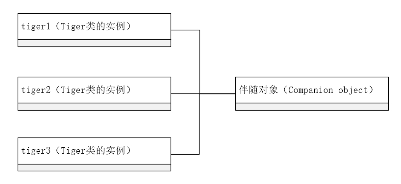

# 面向对象编程

## 类

Kotlin中的类和Java中的类很类似，不过Kotlin可以用更简洁的语法完成。

类的定义使用`class`关键字。与Java不同，实例化类不再需要使用`new`关键字：

```kotlin
class User 
val user = User()
```

由于Kotlin和Java良好的互操作性，如果在Java中使用Kotlin文件中定义的类，使用`new`关键字就可以了：

```java
//Java
User user = new User()
```

实例化类是否使用`new`关键字取决于使用的位置（在Java还是Kotlin文件）而不是类定义的位置。

## 属性

一个**属性**（property）由一个**幕后字段**（backing field）和它的**访问器**（accessor）组成。访问器指的是getter和setter。在Kotlin中，属性可以定义在顶层（文件中），也可以作为一个类的成员。

```kotlin
//Test.kt
val name:String //定义在顶层的属性
```

在Java中，我们考虑到类的**封装**（encapsulation），常见的做法是把字段设为私有（`private`），把访问器（getter和setter）设为公有。


Java中getter和setter的约定：

我们假设属性定义是 `private String name`;定义在`User`类中：

* **getter**：一个不带任何参数的方法，方法名是属性名加上`get`前缀（布尔类型属性的前缀是`is`），如`user.getName()`
* **setter**：带有一个参数的方法，方法名是属性名加上`set`前缀，如`user.setName(String name)`


让我们在一个例子中详细看一下，假设我们需要定义一个数据模型类User，可能需要从外部API（后端）或者数据库中取得数据，有两个成员属性`name`和`age。`下面是Java类的定义：

```kotlin
public class User {
    private int age;
    private String name;
    
    public Person(String name, int age) {
        this.name = name;
        this.age = age;
    }
    
    public int getAge() {
        return age;
    }
    
    public void setAge(int age) {
        this.age = age;
    }
    
    public String getName() {
        return name;
    }
    
    public void setName(String name) {
        this.name = name;
    }
}
```

我们可以看到仅仅有两个属性的类，代码还是不少。虽然许多IDE可以使用快捷键来生成getter和setter，但较多的代码会影响我们的阅读效率，较多的方法增加了重构中出错的可能性。让我们看看使用Kotlin对这个类的等价定义：

```kotlin
class User {
    var name: String
    var age: Int
    constructor(name: String, age: Int) {//等价于Java中的构造器
        this.name = name
        this.age = age
    }
}
```

你或许会奇怪，上面并没有定义getter和setter方法，怎么说它们是等价的呢。实际上，Kotlin编译器会为我们自动生成默认的getter和setter方法，我们无需写任何代码。

上面我们定义的构造器是**次构造器**（secondary constructor）。相对应的，自然有**主构造器**（primary constructor），它定义在类头中。一个类可以有一个主构造器和多个次构造器，我们可以使用主构造器语法重新定义上面的类，代码会少一点：

```kotlin
class User constructor(name: String, age: Int) {
    var name: String
    var age: Int
    
    init {
        this.name = name
        this.age = age
        println("User instance created")
    }
}
```

上面我们使用`init`关键字在**初始化块**（initializer block）中进行初始化操作，初始化块会在类创建时执行，从而完成我们想要的赋值等操作。我们如果不需要其他操作（如上面例子中的打印语句），我们可以直接复制给变量来简化代码：

```kotlin
class User constructor(name: String, age: Int) {
    var name: String = name
    var age: Int = age
}
```

我们看到，构造器中参数的名字和属性的名字是一样的。是的，我们还能直接在主构造器中加上变量修饰符缩短代码：

```kotlin
class User constructor (var name: String, var age: Int)
```

如果主构造器没有任何注解（如`@Inject`），没有**可见性修饰符**（visibility modifier）。这样`constructor`关键字也可以省略：

```kotlin
class User (var name: String, var age: Int)
```

考虑到可读性和减少代码合并时产生的冲突，我们可以在每个参数间进行换行来优化一下代码：

```kotlin
class User(
    var name: String,
    var age: Int
)
```

很难相信，这和一开始我们声明的Java编写的`User`类是等价的，但是Kotlin做到了，Kotlin编译器替我们完成了剩下的工作。这样的代码适用于很多在面向对象编程时使用到的简单类，包含了类的名称、变量类型和名称、构造器和访问器，而且更易读、更易维护。


我们知道，Kotlin中的变量有可变类型（`var`）变量和不可变类型（`val`）变量，在类中`var`修饰的字段会自动生成默认的getter和setter，而`val`修饰的字段仅会生成默认的getter，因为val变量初始化后不能赋值。



Java和Kotlin的属性访问语法

**Java**：通过属性对应的getter或者setter方法访问，如`user.getName()`，`user.setName("Mamun")`。

**Kotlin**：直接使用`.`来访问属性，如`val name = user.name`，`user.name = "Mamun"`。虽然看起来好像失去了封装性，但实际上Kotlin使用的是getter和setter，所以Kotlin相当于在语言层面内置了面向对象的封装。并且在访问属性的同时可以使用自增和自减操作符，如`user.age++`。

由于Kotlin和Java有良好的互操作性，和上节提到的类的实例化语法类似，使用的地点（Java文件还是Kotlin文件中）决定你应该使用哪种语法。


### 自定义getter和setter

有些时候我们会希望在访问属性时进行一些额外的操作，比如验证一些值的正确性、打印一些日志等，这些都可以通过自定义getter和setter实现。

我们知道年龄如果为负数是不合理的，让我们给上面的`User`类中的`age`属性加上负值验证：

```kotlin
class User(var name: String,age:Int) {
    var age = age
    get() {
        println("getter value retrieved")
        return field
    }
    set(value) {
        field = if (value < 0) 0 else value
        println("setter new value assigned $field")
    }
}
//使用示例
val user = User("Mamun",24)
var age = user.age //打印结果：getter value retrieved
user.age = 22 //打印结果：setter new value assigned 22
```

上面自定义的getter和setter仅对`age`属性生效，对`name`属性是不生效的。我们可以看到我们用到了一个特殊的变量`field`，它代表的是对应的幕后字段，在这里我们不能直接使用`age`，因为这样会死循环调用getter。

我们可以看到Kotlin中编写代码时幕后字段和它的getter和setter是放到一起的，这样我们可以很容易地读懂代码逻辑和进行维护。而在Java中我们常常把字段声明在类的顶部，把getter和setter声明在类的底部，我们经常不能在一页中看清楚他们的逻辑。


直接（自定义getter和setter）或间接（自动生成的getter和setter）使用`field`字段的，这样的属性才会有幕后字段，否则（getter和setter都是使用的其他变量）没有幕后字段。


### 延迟初始化属性

有些时候，我们知道这个变量不会为空，但是声明时也不能直接给它赋值。比如常用的存储Android视图引用的变量：

```kotlin
class MainActivity : AppCompatActivity() {
    private var button: Button? = null
    
    override fun onCreate(savedInstanceState: Bundle?) {
        super.onCreate(savedInstanceState)
        button = findViewById(R.id.button) as Button
    }
}
```

`button`变量在声明的时候，布局文件尚未初始化，此时不能给它赋值，为了完成在`onCreate`方法的赋值操作，我们必须声明它为可空类型。这样做是很不方便的，可空类型变量在使用时每次都要进行非空检查或者使用安全调用操作符，而视图变量是一个使用频率又相当高。

这时候我们可以使用`lateinit`修饰符来修饰该变量，告诉编译器它在使用之前不会为空，它的初始化被推迟了，这样我们可以把上面的变量声明为非空类型的：

```kotlin
class MainActivity : AppCompatActivity() {
    private lateinit var button: Button
    
    override fun onCreate(savedInstanceState: Bundle?) {
        button = findViewById(R.id.button) as Button
    }
}
```

这时候确保它非空就是我们程序员的责任了，如果在未被初始化时访问它，会抛出`UninitializedPropertyAccessException`。

延迟初始化的应用场景很常见，不仅出现在视图相关的变量中，还经常出现在依赖注入库、单元测试库等的使用中：

```kotlin
@Inject lateinit var volumeManager: VolumeManager // 使用依赖注入库Dagger
@Mock lateinit var mockEventBus: EventBus // 使用单元测试库Mockito
```

### 注解属性

我们用Kotlin写了一个属性，Kotlin就会为我们生成很多配套的JVM字节码（`privte`字段、getter和setter）。有些时候有些库的注解处理器或基于反射实现的库要求我们的字段设置为`public`。如单元测试库JUnit，它要求我们`@Rule`注解必须加在字段或者getter方法上：

```kotlin
@Rule
val activityRule = ActivityTestRule(MainActivity::class.Java) //无法识别
```

使用Kotlin写这段代码JUnit是无法识别的，我们需要使用注解`@JvmField`来指明这是一个Java字段：

```kotlin
@JvmField @Rule
val activityRule = ActivityTestRule(MainActivity::class.Java)
```

注解`@JvmField`的使用有一定限制：

* 必须有幕后字段
* 可见性不能为`private`
* 没有`open`、`const`、`override`这些修饰符修饰

我们也可以直接注解在getter方法上：

```kotlin
@get:Rule //注解在默认getter方法上
val activityRule = ActivityTestRule(MainActivity::class.Java)

val activityRule//注解在自定义getter方法上
@Rule get() = ActivityTestRule(MainActivity::class.java)
```

### 内联属性

我们可以使用`inline`修饰符来优化属性的调用，前提是没有幕后字段的属性：

```kotlin
inline val now: Long
    get() {
        return System.currentTimeMillis()
    }
```

在编译时，每个`now`属性的调用都会被替换为实际值：

```kotlin
System.currentTimeMillis()
```

内联属性会节省一些额外的创建开销，并能在编写代码时提高可读性。

## 构造器

通过前面我们大概了解到，我们可以定义不带构造器的类，也可以定义带一个主构造器的类，还可以定义一个带主构造器和若干次构造器的类。

需要注意的是，主构造器一个类只能声明一个，属性声明仅能在主构造器中进行，如果需要在次构造器中使用属性，那就需要先在类中声明：

```kotlin
class User(var name: String) {
    var age:Int? = null
    
    constructor(name:String,age:Int):this(name){
        this.age = age
    }
}
```

我们看到上面的例子中，次构造器使用的`this`关键字来调用主构造器。在主构造器定义的类中，必须隐式或者显式地调用主构造器。显式调用主构造器是指直接调用主构造器，隐式调用是指次构造器调用主构造器。

如果子类没有构造器而父类有非空的构造器，则每个次构造器都要使用`super`关键字来初始化基类：

```kotlin
class ProductView : View {
    constructor(ctx: Context) : super(ctx)
    constructor(ctx: Context, attrs : AttributeSet) : super(ctx, attrs)
    constructor(context: Context?, attrs : AttributeSet?, defStyleAttr:
                Int) : super(context, attrs, defStyleAttr)
}
```

构造器默认的可见性是`public`，我们想设置构造器的可见性时，直接在构造器关键字`constructor`前加上可见性修饰符：

```kotlin
class User private constructor()
```

当我们使用像Dagger这样的依赖注入库来注解构造器时也是如此：

```kotlin
class User @Inject constructor()
```

它们也可以一起使用：

```kotlin
class User @Inject private constructor()
```

### 构造器参数和属性

我们已经知道在主构造器中使用`var`或者`val`关键字可以声明属性，如果不使用所声明的仅仅是构造器参数，构造器参数仅仅在构造器中使用，用于类的创建，创建之后，无法像访问类的属性那样访问它：

```kotlin
class User(var name:String, age:Int)
val user = User("Mamun", 27)
println(user.name) // 打印结果：Mamun
println(user.age) // 错误，age只是一个构造器参数
```

下面这个表格列出了他们之间的主要区别：

| 类的声明 | 是否生成getter | 是否生成setter | 类型 |
| :--- | :--- | :--- | :--- |
| `class User(name:String)` | 否 | 否 | 构造器参数 |
| `class User(var name:String)` | 是 | 是 | 属性 |
| `class User(val name:String)` | 是 | 否 | 属性 |

### 构造器的默认参数

如果一个类有很多参数，但有的参数是可选的，为了满足我们多样化的创建需求，在Java中我们会用很多设计模式：

* **伸缩式构造器模式**（Telescoping constructor pattern）:设置一系列的构造器，每个构造器依次增加一个参数。现在已经不推荐这种方式了，因为当参数较多时，代码会难以维护且难以阅读，由于参数的顺序是固定的，在传参时你仍然可能传入你并不设置的参数值。在Android中，仍有少量的类在使用这种方式，比如`android.view.View`类：

```kotlin
val view = View(context)
val view = View(context, attributeSet)
val view = View(context, attributeSet, defStyleAttr)
```

* **JavaBean模式**（JavaBeans pattern）：使用无参构造方法创建对象，通过属性的setter设置参数。这种方式比较适合自动化的赋值，因为手动编写代码时容易遗漏设置操作：

```kotlin
val user = User()
user.setName("Mamun")
user.setAge(27)
```

* **构建者模式**（Builder pattern）：使用构建者对象（Builder）来逐步设置参数，每一步的设置都会返回当前生成的对象，最后使用一个无参的`build`方法完成对象的构造。构建者模式兼顾了伸缩式构造器模式的安全性和JavaBean模式的可读性，但是由于多了一个辅助对象的开销，某些情况下的性能会受到影响：

```kotlin
Retrofit retrofit = new Retrofit.Builder()
                                .baseUrl("https://api.github.com/")
                                .build()
```

好消息是，Kotlin引入了默认参数和命名参数语法，默认参数给了我们传参的可选性，命名参数语法给了我们传参顺序的灵活性，结合这两个特性，我们可以把类的创建工作变得非常简单，我们可以像调用一个函数那样完成类的创建：

```kotlin
class User(var name: String = "", var age: Int = 1, val gender:String = "Unkown")

val user = User()
val user1 = User("Mamun",18)
val user2 = User(gender = "Female")
```

### 初始化块

除了构造器之外，我们还有一种代码结构用于类的初始化，那就是初始化块，使用`init`关键字，在类的实例化过程中，会先执行初始化块再执行构造器：

```kotlin
open class Parent {
    constructor() {
        println("Parent constructor")
    }
    init {
        println("Parent initialization block")
    }
}

Parent()
//打印结果: Parent initialization block
//         Parent constructor
```

它等价于Java中的初始化块。初始化块和构造器的相似之处在于都可以定义多个，都用于类的初始化工作，区别在于：构造器仅会选择一个执行，代码块每一个都会执行。

## 接口

在Kotlin中使用`interface`关键字定义接口：

```kotlin
interface PhoneNumProvider{
    fun validatePhoneNum()
}
```

Kotlin中不使用Java中的`implement`关键字，而是使用`:`来实现接口：

```kotlin
class User:PhoneNumProvider {
    override fun validatePhoneNum() {
        //phoneNumber validation
    }
}
```

Kotlin的接口中还可以定义属性：

```kotlin
interface PhoneNumProvider {
    val phoneNum: String
    fun validatePhoneNum()
}
```

实现接口的类必须实现所有的属性和方法：

```kotlin
class User() : PhoneNumProvider {
    override val phoneNum: String = "1234567"
    override fun validatePhoneNum() {
        //phoneNumber validation
    }
}
```

**覆盖**（`override`）属性可以放在主构造器中：

```kotlin
class User(override val phoneNum: String) : PhoneNumProvider {
    override fun validatePhoneNum() {
        //phoneNumber validation
    }
}
```

和Java8引入的接口默认方法类似，Kotlin也允许接口中定义的方法有默认实现：

```kotlin
interface PhoneNumProvider {
    val phoneNum: String
    val phoneNumLength:Int
    get()= phoneNum.length // 属性get方法的默认实现
    
    fun validatePhoneNum() = phoneNumLength == 11 // 普通方法的默认实现，返回类型被推断为Boolean
}
```

对于默认实现的限制是不能使用幕后字段，因为接口是无状态的。默认实现的意义在于可以将子类中可能重复定义的方法提取出来，使代码更易维护且更具可读性。

和Java中类似，Kotlin中的类只能继承一个类，可以实现多个接口，继承类和实现接口都使用`:`，它们之间用`,`隔开：

```kotlin
open class Human
interface PhoneNumProvider {
    val phoneNum: String
    
    fun validatePhoneNum()
}

interface EmailProvider{
    val email:String
    
    fun validateEmail()
}

class User(override val phoneNum: String,override val email:String):Human(),PhoneNumProvider,EmailProvider {
    override fun validatePhoneNum(){
        //phoneNumber validation
    }
    override fun validateEmail(){
        //email validation
    }
}
```

既然一个类可以实现多个接口，那么如果两个接口中有一样签名的方法该如何呢？假设我们有两个有相同方法的接口：

```kotlin
interface A{
    fun test(){
        print("A")
    }
}
interface B{
    fun test(){
        print("B")
    }
}
```

答案是复写一个方法即可：

```kotlin
class Tester:A,B{
    override fun test(){
        println("tester")
    }
}
```

打印结果以实现的子类为准，因为越靠近继承链底端的类越具体，所复写方法的优先级越高：

```kotlin
Tester().test() // 打印结果：tester
```

如果想使用父类的方法可以使用`super`关键字加方括号引用类名：

```kotlin
class Tester:A,B{
    override fun test(){
        super<A>.test()
        super<B>.test()
    }
}
//使用示例
Tester().test() // 打印结果：AB
```

## 继承

我们已经知道所有类型的父类型是`Any`，等同于Java中的`Object`。每个类都隐式或显式地继承`Any`：

```kotlin
class Animal // 隐式继承Any
class Animal:Any // 显式继承Any
```

与Java不同的是，在Kotlin中每个类默认加上了`final`修饰符。由于多态的存在，参数可以传指定类型的子类型，意料之外的子类型传值可能会引起意外的行为。所以Kotlin引入了这个特性来增强继承方面的安全性。

和Java一样，Kotlin也是单继承的。但继承不再使用`extends`关键字，而是`:`

```kotlin
class Animal
class Tiger:Animal() //错误，final修饰的类无法被继承 
```

我们要使一个类可以被继承，要显式地加上`open`修饰符，它就像`final`的反义词：

```kotlin
open class Animal
class Tiger:Animal() //正确
```

需要注意的是，类中的属性和方法默认也是`final`的，我们需要给每一个想要覆盖的成员加上`open`关键字：

```kotlin
open class Animal(){
    open var name:String = "Unkown"
    open fun eat(){}
}
class Tiger:Animal(){
    override var name:String = "Tiger"
    override fun eat(){
        println("Tiger is eating")
    }
}
```

在上面`Animal`类中我们并不想实现`eat`方法，只是定义了一个行为，把它声明为抽象类是更好的方案。声明抽象成员和抽象类需要使用`abstract`关键字：

```kotlin
abstract class Animal(){
    abstract var name:String // 用了abstract之后，不初始化变量
    abstract fun eat() // 用了abstract之后，没有方法体
}
```

这样修改之后，前面例子中的`Tiger`类依然是正确的。被`abstract`修饰的类和成员默认是`open`的，因为它们需要继承来实现具体的操作。


**抽象类**（abstract class）和**接口**（interface）：

**抽象类**：抽象类是使用`abstract`修饰符修饰的类，它只能用作基类不能实例化。

* 抽象类中可以有抽象成员也可以有普通成员
* 如果一个子类实现了父类（抽象类）的所有抽象方法，那么该子类可以不必是抽象类，否则就依然是抽象类
* 抽象方法没有方法体，抽象属性不初始化变量

**接口**：接口使用`interface`修饰符修饰，它也不能被实例化。

* 一个类只能继承一个类，但是可以实现多个接口
* 接口中的成员默认均是抽象的


## JvmOverloads注解

我们前面在构造器一节提到Android中的`View`类使用的是伸缩式构造器模式。如果有时我们想自定义视图的话，我们的构造器可能是这样声明的：

```kotlin
class CustomView : View {
    constructor(context: Context?) : this(context, null)
    constructor(context: Context?, attrs: AttributeSet?) :this(context, attrs, 0)
    constructor(context: Context?, attrs: AttributeSet?, defStyleAttr:Int) : 
                super(context, attrs, defStyleAttr) {
        //...
    }
}
```

这样的写法可以看到有许多冗余的代码，Kotlin的解决方案是使用`@JvmOverload`注解：

```kotlin
class CustomView @JvmOverloads constructor(
    context: Context,
    attrs: AttributeSet? = null,
    defStyleAttr: Int = 0
) : View(context, attrs, defStyleAttr)
```

该注解会告知编译器生成额外的JVM字节码构造器重载：

```kotlin
public CustomView(Context context) {
    super(context);
}
public CustomView(Context context, @Nullable AttributeSet attrs) {
    super(context, attrs);
}
public CustomView(Context context, @Nullable AttributeSet attrs, int defStyleAttr) {
    super(context, attrs, defStyleAttr);
}
```

我们可以看到Kotlin在提升与Java的互操作性方面做出的努力。

## 数据类

我们在开发工作经常会创建一些用于存储数据的类（存储来自数据库或者服务器的数据）。在Java中我们需要写出许多getter和setter，还经常会覆盖`hashCode`、`equals`等方法。虽然Android Studio可以生成其中的大部分代码，但维护工作仍然是一个问题。

我们已经了解到Kotlin会为我们自动生成getter和setter方法。Kotlin实际上做了更多，我们可以使用`data`关键字来修饰一个类：

```kotlin
data class Product(var name: String, var price: Double)
```

这样修饰后的数据类编译器会为我们自动生成相应的`equals`、`hashCode`、`toString`、`copy`和多个`componentN` 方法。需要注意的是，data关键字不能和`abstract`、`inner`、和`sealed`一起使用。

让我们具体来看一下这些方法。

### equals和hashCode方法

在处理数据类时，我们经常需要比较两个实例是否数据相等**据**，意思是验证它们是否包含同样的数据而非验证它们是否是同一个实例。常见的做法是使用`equals`方法：

```kotlin
product.equals(product1)
```

`equals`方法内部实现用到了`hashCode`方法，它们之间有一个**合约**（contract）用法：

* 如果两个对象相等，则它们必须具有相同的哈希码。
* 如果两个对象具有相同的哈希码，则它们可以相等也可以不相等（因为我们可以根据需要比较其它字段）。

所以，我们覆盖`equals`方法就必须覆盖`hashCode`方法，否则会出现意料之外的行为。如果我们只想覆盖`hashCode`方法，`equals`方法则不必覆盖。

覆盖`hashCode`方法的一般做法是让两个相等（相等根据具体的需求来定，完全相等或是结构相等甚至别的需求）的对象有一样的哈希码。

我们来看一下上面`Product`类的Java实现：

```kotlin
public class Product {
    private String name;
    private Double price;
    
    public Product(String name, Double price) {
        this.name = name;
        this.price = price;
    }
    
    @Override
    public int hashCode() {
        int result = name != null ? name.hashCode() : 0;
        result = result + (price != null ? price.hashCode() : 0);
        return result;
    }
    
    @Override
    public boolean equals(Object o) {
        if (this == o) {
            return true;
        }
        if (o == null || getClass() != o.getClass()) {
            return false;
        }
        Product product = (Product) o;
        if (name != null ? !name.equals(product.name) :product.name != null) {
            return false;
        }
        return price != null ? price.equals(product.price) :product.price == null;
    }
    
    public String getName() {
        return name;
    }
    public void setName(String name) {
        this.name = name;
    }
    public Double getPrice() {
        return price;
    }
    public void setPrice(Double price) {
        this.price = price;
    }
}
```

在很早之前，使用Java需要手动编写所有的代码。现在，像Android Studio这样的现代IDE可以自动为我们生成这样的代码，但我们仍需要维护这些代码以确保它们在修改或重构之后能够正常工作。

在Kotlin中，这个问题将迎刃而解，下面这个类的定义包含上面Java实现的所有方法，仅仅需要在普通类声明前加上`data`关键字：

```kotlin
data class Product(var name: String, var price: Double)
```

我们在使用**结构相等操作符**（structural equality operator）`==`时，始终在幕后调用的是`equals`方法，有了如上定义之后：

```kotlin
val productA = Product("Glove", 19.9)
val productB = Product("Glove", 19.9)
val productC = Product("Earphone", 29.9)
print(productA == productA) // 打印结果: true
print(productA == productB) // 打印结果: true
print(productB == productA) // 打印结果: true
print(productA == productC) // 打印结果: false
print(productB == productC) // 打印结果: false
```

默认情况下，编译器生成的`equals`方法比较的是声明在主构造器中的属性，这适用于大多数情况。如果我们需要自定义实现，我们可以覆盖`equals`方法，编译器不会再生成默认实现。

### toString 方法

默认生成的方法中含有所有包含在主构造器中的属性信息：

```kotlin
data class Product(var name:String, var price:Double)
val productA = Product("Glove", 19.9)
println(productA) // 打印结果：Product(name=Glove, price=19.9)
```

相比于普通类`toString`实现中的类名+内存地址（Product@28a418fc），我们可以在控制台或者日志中输出更易读的信息。

### copy 方法

默认情况下，数据类还会生成适当的copy方法，用于创建某个类的副本：

```kotlin
data class Product(var name:String, var price:Double)

val productA = Product("Glove", 19.9)
println(productA) // 打印结果：Product(name=Glove, price=19.9)
val productB = productA.copy()
println(productB) // 打印结果：Product(name=Glove, price=19.9)
```

`copy`方法中含有主构造器中对应的所有参数，我们还可以结合命名参数语法修改任意参数：

```kotlin
val productA = Product("Glove", 19.9)
val productB = productA.copy(name = "Earphone")
val productC = productA.copy(name = "Earphone",price = 39.9)
println(productA) // 打印结果：Product(name=Glove, price=19.9)
println(productB) // 打印结果：Product(name=Earphone, price=19.9)
println(productC) // 打印结果：Product(name=Earphone, price=39.9)
```

`copy`方法产生的副本是浅拷贝（只复制当前对象，不复制对象中的对象），拷贝前后两个对象中的对象仍是共用一个：

```kotlin
data class Producer(val name:String,var address:String)
data class Product(val name:String, val price:Double, val producer:Producer)

val productA = Product("Glove", 19.9,Producer("A","China"))
val productB = productA.copy()
productA.producer.address = "America"
println(productA) // 打印结果：Product(name=Glove, price=19.9, producer=Producer(name=A, address=America))
println(productB) // 打印结果：Product(name=Glove, price=19.9, producer=Producer(name=A, address=America))
```

在属性声明中使用不可变型变量`val`，然后通过其副本修改数据，这样做的好处是自由地在多线程操作中共享数据，以防止可变型变量`var`在多线程操作中潜在的错误共享错误。

### 解构声明与componentN 方法

有些时候我们需要将对象中的属性值赋给单个变量进行操作，我们可以使用一种叫做**解构声明**（Destructuring declaration）的语法：

```kotlin
data class Product(val name:String, val price:Double)

val productA = Product("Glove", 19.9)
var (name,price) = productA
println(name) // 打印结果：Glove
println(price) // 打印结果：19.9
```

解构声明允许我们一次性声明和赋值多个变量。上面的代码会创建两个可变型变量`name`和`price`并赋值。编译器生成的代码像下面这样：

```kotlin
val productA = Product("Glove", 19.9)
var name = productA.component1()
var price = productA.component2()
```

每一个定义在主构造器的属性编译器都会生成一个`componentN`方法，其中N是在主构造器中声明的顺序，前面的`Product`类中`name`对应的是`component1`，`price`对应的是`component2`。我们可以直接调用它们：`var name = productA.component1()`，但是这样的代码意义不明且难以维护。我们还是将他们留给编译器，我们使用阅读性更强的解构声明。

我们还可以在解构声明中用`_`来将不需要的值省略：

```kotlin
val productA = Product("Glove", 19.9)
var (_,price) = productA
println(price) // 打印结果：19.9
```

我们还可以在字符串中使用解构声明：

```kotlin
val file = "MainActivity.kt"
val (name, extension) = file.split(".", limit = 2)
println(name) // 打印结果：MainActivity
println(extension) //打印结果：kt
```

还可以在遍历中使用：

```kotlin
val products = listOf(
    Product("Glove", 19.9),
    Product("Earphone", 39.9)
)
println("Products:")
for ((name, price) in products) {
    println("$name :$price")
}
//打印结果：Products:
//         Glove :19.9
//         Earphone :39.9
```

需要注意的是，在本节开始我们说了，这些方法是加上`data`关键字的类编译器才会自动生成的，所以别忘了这一点。

## 操作符重载

Kotlin有一组预定义的运算符，有固定的符号表示形式（例如+， 和\*）和固定的优先级。大多数运算符被直接转换为方法调用，一些被翻译成复杂一些的表达式，详见下表：

| 操作符示例 | 对应的方法/表达式 |
| :--- | :--- |
| `a + b` | `a.plus(b)` |
| `a - b` | `a.minus(b)` |
| `a * b` | `a.times(b)` |
| `a / b` | `a.div(b)` |
| `a % b` | `a.rem(b`\) |
| `a..b` | `a.rangeTo(b)` |
| `a += b` | `a.plusAssign(b)` |
| `a -= b` | `a.minusAssign(b)` |
| `a *= b` | `a.timesAssign(b)` |
| `a /= b` | `a.divAssign(b)` |
| `a %= b` | `a.remAssign(b)` |
| `a++` | `a.inc()` |
| `a--` | `a.dec()` |
| `a in b` | `b.contains(a)` |
| `a !in b` | `!b.contains(a)` |
| `a[i]` | `a.get(i)` |
| `a[i, j]` | `a.get(i, j)` |
| `a[i, ..., n]` | `a.get(i, ..., n)` |
| `a[i] = b` | `a.set(i, b)` |
| `a[i, j] = b` | `a.set(i, j, b)` |
| `a[i, ..., n] = b` | `a.set(i_1, ..., i_n, b)` |
| `a()` | `a.invoke()` |
| `a(i)` | `a.invoke(i)` |
| `a(i, j)` | `a.invoke(i, j)` |
| `a(i, ..., n)` | `a.invoke(i, ..., n)` |
| `a == b` | `a?.equals(b) ?: (b === null)` |
| `a != b` | `!(a?.equals(b) ?: (b === null))` |
| `a > b` | `a.compareTo(b) > 0` |
| `a < b` | `a.compareTo(b) < 0` |
| `a >= b` | `a.compareTo(b) >= 0` |
| `a <= b` | `a.compareTo(b) <= 0` |

当我们使用某个特定的操作符时（左列），编译器会将其转换为对应的函数调用（右列）。

我们可以用`operator`关键字自定义对应的函数实现，这样的自定义实现称作**操作符重载**（operator overloading）。

让我们试着在一个`Point`类中重载一个`+`操作符：

```kotlin
data class Point(var x: Double, var y: Double) {
    operator fun plus(point: Point) = Point(x + point.x, y+ point.y)
}

var p1 = Point(5.8, 2.7)
var p2 = Point(6.5, 4.2)
println(p1 + p2) //打印结果：Point(x=12.3, y=6.9)
```

通过重载`plus`方法，当每次使用`+`操作符时，都会调用相应的操作符方法（`plus`），在底层编译器会生成函数调用的方法：

```kotlin
p1.plus(p2)
```

在我们上面的例子中我们的`plus`的参数列表用了`Point`类型，但这并不是必须的，操作符重载并不像方法覆盖那样需要继承一个类，还有固定的参数和固定的数据类型，操作符重载对应的方法参数列表并不是固定的。不过，有些方法的返回值类型是固定的，比如`plusAssign`对应的`+=`操作符是一个语句，返回值类型需要是`Unit`。所以运算符重载的方法定义相当灵活，我们可以定义多个相同名称不同参数的重载方法：

```kotlin
data class Point(var x: Double, var y: Double) {
    operator fun plus(point: Point) = Point(x + point.x, y +point.y)
    operator fun plus(increment:Double) = Point(x + increment, y + increment)
    operator fun plus(prefix:String) = "$prefix ${this.toString()}"
}

var p1 = Point(5.8, 2.7)
var p2 = Point(6.5, 4.2)
println(p1 + p2) //打印结果：Point(x=12.3, y=6.9)
println(p1 + 2.4) //打印结果：Point(x=8.2, y=5.1)
println(p1 + "Detail:") // 打印结果：Detail: Point(x=5.8, y=2.7)
```

基本的操作符对应有组合操作符（`+`对应`+=`），只要定义了基本操作符的重载方法，组合操作符也就无需定义了，它会自动调用：

```kotlin
var p1 = Point(5.8, 2.7)
var p2 = Point(6.5, 4.2)
p1+=p2
println(p1) //打印结果：Point(x=12.3, y=6.9)
```

如果我们同时定义了相同参数的`plus`和`plusAssign`重载方法，再使用`+=`操作符时编译器会抛出错误，因为编译器不知道应该调用哪个方法：

```kotlin
data class Point(var x: Double, var y: Double) {
    operator fun plus(point: Point) = Point(x + point.x, y + point.y)
    operator fun plusAssign(point:Point) {
        x += point.x
        y += point.y
    }
}

var p1 = Point(5.8, 2.7)
var p2 = Point(6.5, 4.2)
var p3 = p1+p2 //正确
p1+=p2  //错误，Assignment operations ambiguity
```

我们最好只定义基本操作符。如果真的有需求需要同时定义，记得要使用不同的参数。

有个好消息是，虽然Java不支持操作符重载，但由于Kotlin和Java良好的互操作性，Kotlin可以使用Java中满足要求（方法名、返回值，可见性等）的操作符重载：

```kotlin
// Java
public class Point {
    private final int x;
    private final int y;
    
    public Point(int x, int y) {
        this.x = x;
        this.y = y;
    }
    
    public int getX() {
        return x;
    }
    public int getY() {
        return y;
    }
    public Point plus(Point point) { //不需要operator关键字，因为Java不支持
        return new Point(point.getX() + x, point.getY() + y);
    }
}
//Kotlin
var p1 = Point(5.8, 2.7)
var p2 = Point(6.5, 4.2)
println(p1 + p2) //打印结果：Point(x=12.3, y=6.9)
```

## 对象声明（Object declaration）

在开发工作中我们经常会使用单例模式，单例模式可以帮助我们控制实例的数目，节约系统资源。在Java中通常的实现方式像这样：

```kotlin
public class Singleton {
    private static Singleton instance = null;
    
    private Singleton(){}
    
    private synchronized static void createInstance() {//synchronized关键字保证线程安全
        if (instance == null) {
            instance = new Singleton();
        }
    }
    public static Singleton getInstance() {
        if (instance == null) createInstance();
        return instance;
    }
}
```

这种解决方案有的大多是固定的部分，而我们每次实现的时候都要全部写出来，代码有冗余。Kotlin有一种特殊的语言结构叫做对象声明，可以简化单例的创建。

或许你会好奇为何根对象在Kotlin中变成了`Any`而不是`Object`，请考虑一下两点：

* Kotlin不仅支持面向对象编程，而且支持函数式编程
* 对象声明使用了`object`关键字

对象声明和类的声明很像，只是把`class`关键字替换为`object`关键字：

```kotlin
object Singleton
```

我们可以像普通类那样像其中添加成员：

```kotlin
object SQLiteSingleton {
     val TAG = "SQLiteSingleton"
     fun getAllUsers(): List<User> {
         //...
     }
}
```

这些成员的访问像访问Java中静态成员那样：

```kotlin
SQLiteSingleton.TAG
SQLiteSingleton.getAllUsers()
```

像Java中实现的单例模式一样，它是使用时才会被初始化的。它可以被嵌套在其他对象声明中或者非内部类中，但它不能赋值给变量。


在Kotlin中，我们可以感觉到对象这个术语又增加了新的含义：一种特殊的语言结构。


## 对象表达式（Object expression）

使用Java在Android开发的时候经常会使用到匿名类（类名省略）的用法：

```java
OnClickListener mClickListener = new View.OnClickListener(){       
     @Override
     public void onClick(View v){
         System.out.pritln("Click");
     }
};
```

匿名类实现的功能和具名类是一样的，但是用匿名类更加简洁方便。形式上像是实例化了一个接口，但是接口是不能实例化的，它实际上是一个实现了接口的类，只是类名省略了，我们仍需要覆盖所实现接口中的方法后才能使用。

我们本章一开始就提到了在Kotlin中实例化对象不再使用`new`关键字，那么我们应该如何使用像Java一样使用简洁的匿名类语法呢？

我们可以使用对象表达式来实现：

```kotlin
val mClickListener = object : View.OnClickListener{
     override fun onClick(v : View){
         println("Click")
     }
};
```

不仅可以用匿名类实现接口，也可以继承类：

```kotlin
val broadcastReceiver = object : BroadcastReceiver() {
    override fun onReceive(context: Context, intent: Intent) {
        println("Got a broadcast ${intent.action}")
    }
}
```


 **适配器模式\(Adapter pattern\)**：将一个接口转换成客户希望的另一个接口，使接口不兼容的类可以一起工作，其别名为包装器\(Wrapper\)。


假设我们像实现一个视频播放功能，我们可能定义这样的接口和方法来播放视频：

```kotlin
interface Player {
    fun play()
}

fun playWith(player: Player) {
    print("playing video")
    player.play()
}
```

假设我们使用的第三方的类库，其中的视频播放类提供了`play`方法：

```kotlin
open class VideoPlayer {
    fun play() {
        println("Play videos")
    }
}
```

现在我们的问题是第三方的接口并没有实现我们的`Player`接口，也就不能和我们定义的`playWith`方法一起工作。我们知道适配器模式常用的实现方式就是继承所有需要的类和接口，不能继承的类采用委托。我们使用最新认识的对象表达式可以同时继承类和接口，很方便地实现适配器模式：

```kotlin
val player = object: VideoPlayer(), Player {}
playWith(player)
```

这一工作如果使用Java来做将会多写许多代码。同时，对象表达式中可以像普通类一样定义变量，像普通类那样访问：

```kotlin
val player = object: VideoPlayer(), Player {
    val length = 0
}
println(player.length) // 打印结果：0
```

## 伴随对象（Companion object）

前面的对象声明展示了如何像Java那样定义和访问静态成员。Kotlin还允许我们定义一种与类关联的对象，这个对象也是单例的，并与所有关联类的实例分享其状态。该对象是所关联类的伴随对象，对应的，被关联的类是该对象的伴随类。



前面的图示表示了三个`Tiger`类的实例关联同一个伴随对象。这样的示例用代码表示如下：

```kotlin
class Tiger {
    companion object {}//声明伴随对象的语法
}
val tiger1 = Tiger()
val tiger2 = Tiger()
val tiger3 = Tiger()
```

在伴随对象中定义的成员可以像访问Java静态方法那样访问它，这是一个定义与一个类相关而不是每个实例都相关的行为的好地方。比如工厂方法、Activity的请求码，放置配置或者数据对应的Key等等。

让我们看一个常见的定义`start`方法的例子：

```kotlin
//MainActivity.kt
class MainActivity : AppCompatActivity() {
    override fun onCreate(savedInstanceState: Bundle?) {
        super.onCreate(savedInstanceState)
        val user = intent.getParcelableExtra<User>(KEY_USER) //取得数据
        //...
    }
    
    companion object {
        const val KEY_USER = "user" 
        fun start(context: Context, user: User) { // 可以像访问静态方法那样访问该方法
            val intent = Intent(context,MainActivity::class.java)
            intent.putExtra(KEY_USER , user) // 放入数据
            context.startActivity(intent)
        }
    }
}
// 使用示例
MainActivity.start(context, user)
```

我们可以看到我们可以在`Acticity`创建之前就调用`start`方法，正如我们经常在Java中使用的静态方法。我们把它与所应用的类关联起来显然变得更易读和管理了。伴随类可以随意使用伴随对象的成员，伴随对象却不能随意使用伴随类的成员，就像在Java中静态成员不能使用非静态成员那样。

伴随对象在底层实现中存在一个类`Companion`，我们可以在调用链中加上这个类名，但在Kotlin中一般不这么做（代码冗余），而在Java中需要这么调用：

```kotlin
MainActivity.Companion.start(context, user)
```

伴随对象是延迟加载的，当你第一次访问它的时候才会创建：

```kotlin
class A {
    companion object {
        var a: Int = 0
        init {
            println("companion object created")
        }
    }
}
//使用示例
A.a // 打印结果: companion object created
```

当类实例化时无论你是否访问了伴随对象的成员，伴随对象都会创建且会首先创建，创建之后再次实例化类就不会再创建伴随对象，所有的类实例共享一个伴随对象：

```kotlin
class A {
    init {
        println("Inatance created")
    }
    companion object {
        var a: Int = 0
        init {
            println("companion object created")
        }
    }
}
//使用示例
A()
// 打印结果: companion object created
//          Inatance created
A() // 打印结果: Inatance created
```

伴随对象还可以像普通类那样包含函数，实现接口，以及继承类。我们之前用Java实现的静态成员大多可以通过伴随对象实现，便于管理且提高了可读性。

## 枚举类

枚举类型是一组命名值组成的数据类型。定义一个枚举类型，我们需要将`enum`关键字添加到类声明中：

```kotlin
enum class Suit {
    HEART,
    SPADE,
    CLUB,
    DIAMOND,
}
val hostSuit = Suit.HEART
```

和Java一样，将`String`转化为枚举类型使用`valueOf`方法，或者使用Kotlin辅助方法`enumValueOf`：

```kotlin
val selectedSuit1 = Suit.valueOf("HEART")
val selectedSuit2 = enumValueOf<Suit>("HEART")

println(selectedSuit1 == Suit.HEART) // 打印结果：true
println(selectedSuit2 == Suit.HEART) // 打印结果：true
```

和Java一样获取枚举类中的所有值使用`values`方法，或者使用Kotlin辅助方法`enumerateValues`：

```kotlin
for (suit in Suit.values()) {
    println("name: ${it.name}, ordinal: ${it.ordinal}")
}
for (suit in enumValues<Suit>()) {
    println("name: ${it.name}, ordinal: ${it.ordinal}")
}

// 打印结果：
// name: HEART, ordinal: 0
// name: SPADE, ordinal: 1
// name: CLUB, ordinal: 2
// name: DIAMOND, ordinal: 3
```

枚举类同样可以有自己的构造器，假设我们需要一张图片来代表它们的形状：

```kotlin
enum class Suit (val iamgeUrl:String){
    HEART("https://www.xxxx.com/suit=heart"),
    SPADE("https://www.xxxx.com/suit=spade"),
    CLUB("https://www.xxxx.com/suit=club"),
    DIAMOND("https://www.xxxx.com/suit=diamond")
}
```

我们还可以在其中定义方法，对每个枚举值都有效：

```kotlin
enum class Suit (val imageUrl:String){
    HEART("https://www.xxxx.com/suit=heart"),
    SPADE("https://www.xxxx.com/suit=spade"),
    CLUB("https://www.xxxx.com/suit=club"),
    DIAMOND("https://www.xxxx.com/suit=diamond");
    
    fun downloadImage() {
        println("downloading image from $imageUrl")
        //...
    }
}

Suit.DIAMOND.downloadImage() // 打印结果：downloading image from https://www.xxxx.com/suit=diamond
```

请注意，`DIAMOND`定义后面少见地用到了分号，这是为了区分枚举值定义和成员定义。

我们还可以定义抽象成员，然后在每个枚举值定义中覆盖：

```kotlin
enum class Suit (val imageUrl:String){
    HEART("https://www.xxxx.com/suit=heart"){
        override val chineseName = "红桃"
    },
    SPADE("https://www.xxxx.com/suit=spade"){
        override val chineseName = "黑桃"
    },
    CLUB("https://www.xxxx.com/suit=club"){
        override val chineseName = "梅花"
    },
    DIAMOND("https://www.xxxx.com/suit=diamond"){
        override val chineseName = "方片"
    };
    
    abstract val chineseName:String
    fun downloadImage() {
        println("downloading image from $imageUrl")
        //...
    }
}
```

### 中缀调用

中缀调用是一种特殊的函数调用方式，更接近自然语言。我们在第二章的时候介绍Pair类型的时候见过：

```kotlin
var pair = "Everest" to 8848
```

本质上，它还是一种函数调用，只不过用了不同的语法，我们仍然可以用`.`来进行常规调用：

```kotlin
val mountain = "Everest";
var pair = mountain.to(8848)
```

之所以把中缀调用介绍放在了本节，是为了和枚举类合起来举例，我们以标准扑克牌52张牌（4种花色13个牌等）为例，让我们看看能达到怎样的效果。

首先让我们枚举花色和牌等：

```kotlin
enum class Suit {
    HEART,
    SPADE,
    CLUB,
    DIAMOND
}
enum class Rank {
    TWO, THREE, FOUR, FIVE,SIX, SEVEN, 
    EIGHT, NINE,TEN, JACK, QUEEN, KING, ACE
}
```

那么一张扑克牌就可以用牌等和花色来表示：

```kotlin
data class Card(val rank: Rank, val suit: Suit)
```

接下来让我们在枚举类`Rank`中自定义一个中缀调用函数，使用`infix`关键字：

```kotlin
enum class Rank {
    TWO, THREE, FOUR, FIVE,SIX, SEVEN,
    EIGHT, NINE,TEN, JACK, QUEEN, KING, ACE;
    
    infix fun of(suit: Suit) = Card(this, suit)
}
```

那么我们可以用非常接近自然语言的方式表示一张扑克牌：

```kotlin
val card = Rank.FIVE of Suit.HEART
//甚至可以再缩短语法
import Rank.FIVE
import Suit.HEART

val card = FIVE of HEART
```

我们可以看到，扑克牌的表示变得非常简单、易读并且是类型安全的，我们不必担心因为失误创建了错误的卡牌。

下面三种表示方式可以达到一样的效果：

```kotlin
import Rank.FIVE
import Suit.HEART

val card1 = FIVE of HEART // 中缀调用
val card2 = FIVE.of(HEART) // 常规调用
val card3 = Card(FIVE,HEART) // 构造器创建
```

那么中缀调用显而易见的优点是它的可读性，有些时候往我们的函数前加一个`infix`，可能会使我们的维护工作更加轻松。

## 可见性修饰符（访问修饰符）

**可见性修饰符**（visibility modifier），也叫访问修饰符（access modifier）。Kotlin支持四种类型的可见性修饰符：`private`、`protected`、`public`、和`internal`。Kotlin与Java在这方面的最大区别就是Kotlin的默认可见性修饰符是`public`，而Java是`default`（包内可见），它们在声明中都是可以省略的。根据顶层元素和成员元素的不同，修饰符产生的效果也不一样。


顶层元素和成员元素的区分在于其声明的位置：

**顶层元素**：直接声明在代码文件中的元素，Kotlin除类和接口外，对象、函数、变量等也可以直接定义在顶层。

**成员元素**：声明在类、接口和对象（指Kotlin中特有的语言结构）中的元素，主要指方法、属性、构造器、对象、伴随对象甚至嵌套类和嵌套接口等。


首先看可见性修饰符对顶层元素的影响：

`public`：元素在任何文件中可见

`private`：元素在所声明的代码文件中可见

`protected`：顶层元素不可使用该修饰符

`internal`：在同一模块中任何文件中可见，在同一模块中相当于`public`修饰符，不同模块则不可见


**模块**（module）是指一同编译的代码文件集合，比如：

* IntelliJ IDEA 模块
* Maven 项目
* Gradle 源代码集（例外是 `test` 源代码集可以访问`main`的`internal`声明）
* 一次Ant任务执行所编译的一套文件

模块化的程序能够更好地分散职责，加速构建，因为仅需要重新编译修改过的模块。


下面我们来看一个示例：

```kotlin
//example.kt
public val tag: String = "example" // 该属性为public，默认情况下（不加任何修饰符）也具有同样的效果
private class User // 仅在定义的文件中可访问
internal fun doSomething() { // 相同模块中可访问
    println("doSomething")
}

fun main() {
    println(tag) // 打印结果：example
    User() // 可访问
    doSomething() // 打印结果：doSomething
}
//another.kt(和example.kt处于同一模块)
fun main() {
    println(tag) // 可访问
    User() // 错误，不可访问
    doSomething() // 可访问
}
//main.kt(和example.kt处于不同模块)
fun main() {
    println(tag) // 可访问
    User() // 错误，不可访问
    doSomething() // 错误，不可访问
}
```

在Kotlin中，没有和**包**（package）相关的可见性修饰符。

可见性修饰符对成员元素的影响：

* `public`：在包含成员元素的类、接口或对象中及使用这些包含这些成员元素实例的代码文件中可见
* `private`：仅在包含成员元素的类、接口或对象中可见
* `protected`：在包含成员元素的类、接口及其子类型中可见，不适用于声明在对象中的成员，因为对象无法被继承
* `internal`：和顶层元素类似，`internal`在同一模块中相当于`public`修饰符，不同模块中不可见

让我们在一个类中声明一些成员，看看可见性修饰符对其成员的影响：

```kotlin
class User {
    public val name: String = "MamunLiu"
    private var age:Int = 27
    protected fun login() {}
    internal fun logout() {}
}
//main.kt 和User类定义在同一个模块
val user = User()
println(user.name) // 打印结果：MamunLiu
println(user.age) // 错误，age仅能在User类中访问
user.login() // 错误，login方法仅能在User类及其子类中访问
user.logout() // 可以访问
//another.kt 和User类定义在不同模块
val user = User()
println(user.name) // 打印结果：MamunLiu
println(user.age) // 错误，age仅能在User类中访问
user.login() // 错误，login方法仅能在User类及其子类中访问
user.logout() // 错误，logout方法仅能模块内部访问
```

我们前面说过，Kotlin的默认可见性修饰符是`public`，但若是声明为`protected`的成员在子类覆盖后默认仍是`protected`：

```kotlin
open class User {
    protected open fun login() {}
}
class Admin() : User() {
    override fun login() {}
}

val user = User()
user.login() // 错误，login方法只能在User类及其子类中访问
val admin = Admin()
admin.login() // 错误，login方法只能在Admin类及其子类中访问
```

不过我们主动更改覆盖后成员的可见性修饰符，以便削弱访问限制满足我们的具体需求：

```kotlin
class Admin() : User() {
    public override fun login() {}
}

val admin = Admin()
admin.login() // 可以访问
```

如果我们想修改构造器的可见性，我们需要显式写出`constructor`关键字并加上可见性修饰符：

```kotlin
class User private constructor (){}
```

之前我们说过Kotlin编译器会为我们自动生成getter和setter方法，这些方法的可见性默认是和属性的可见性一致的，如果我们想修改这些方法的可见性，那么我们需要显式地写出来：

```kotlin
class User {
    var name:String = "MamunLiu"
    private set // 如果仅仅是修改setter可见性则无需写出函数体，编译器依旧会为我们自动生成
}

 User().name = "SuperMan" //错误，setter是private修饰符，仅能在User类中访问
```

最后，局部变量、函数和类不能使用可见性修饰符。

## 密封类（Sealed class）

密封类是限制了继承层级的类，在Kotlin1.1之前，密封类的子类要声明在密封类之内，1.1之后放宽了这个限制，但密封类及其子类也需要声明在同一个文件中，声明密封类只需要在`class`关键字之前加`sealed`关键字即可：

```kotlin
// Animal.kt
sealed class Animal()
class Tiger : Animal()
class Cat : Animal()
class Monkey : Animal()
```

我们可以在一个文件中看到所有可能的子类，在上面的例子中，我们在其他文件中将不能继承该`Animal`类。密封类对于继承的限制仅限于对它的直接继承，如果是对其子类的继承仍然是可以的：

```kotlin
// Animal.kt
sealed class Animal()
open class Tiger : Animal()
// Zoo.kt
class SiberianTiger : Tiger() 
```

如果我们不想让外部再继承子类可以继续给子类加上`sealed`关键字：

```kotlin
// Animal.kt
sealed class Animal()
sealed class Tiger : Animal()
sealed class Cat : Animal()
sealed class Monkey : Animal()
```

由于密封类这种对继承层级的保护，编译器可以确定所有可能的情况，搭配`when`使用时就不再需要`else`语句了：

```kotlin
when (animal) {
    is Tiger -> println("Weighs 200-400 kg")
    is Cat -> println("Weighs 2.5-5.5 kg")
    is Monkey -> println("Weighs 20-300 kg")
}
```

可以预见的是，如果我们以后添加了别的`Animal`的子类，上面的代码将不会通过编译。与Java的`switch`语句会通过编译但有可能崩溃相比，我们可以把一个运行时错误提前到编译时错误，这样会更加安全。

密封类默认是抽象的，所以加`abstract`关键字是多余的，自然它也没有办法实例化。`sealed`关键字也不可以和`open`或者`final`关键字一起使用，因为它们三个代表的是三种继承限制，是同一功能的。

`object`是可以继承密封类的，这样这个子类就成了一个单例：

```kotlin
// Animal.kt
sealed class Animal()
object Human:Animal()
```

密封类的特性在我们实现有限状态机、自定义的数据结构等方面很有帮助，有兴趣的朋友可自行延伸，本书主要讨论Kotlin在Android方面的运用。

